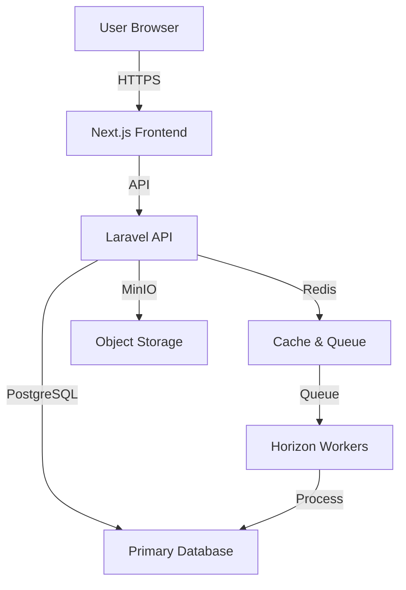
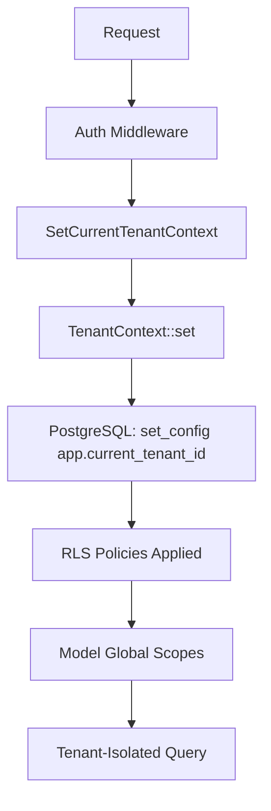
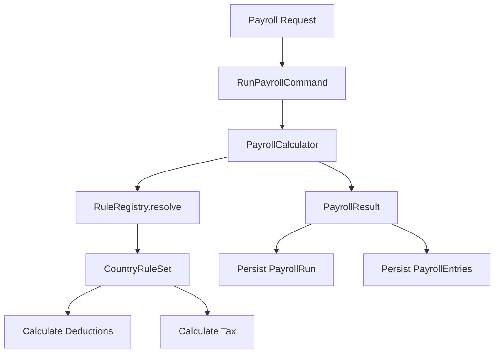
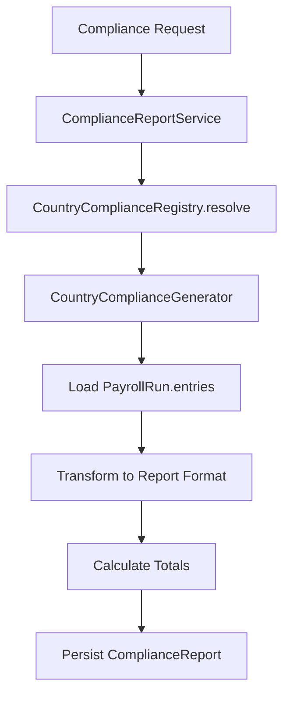
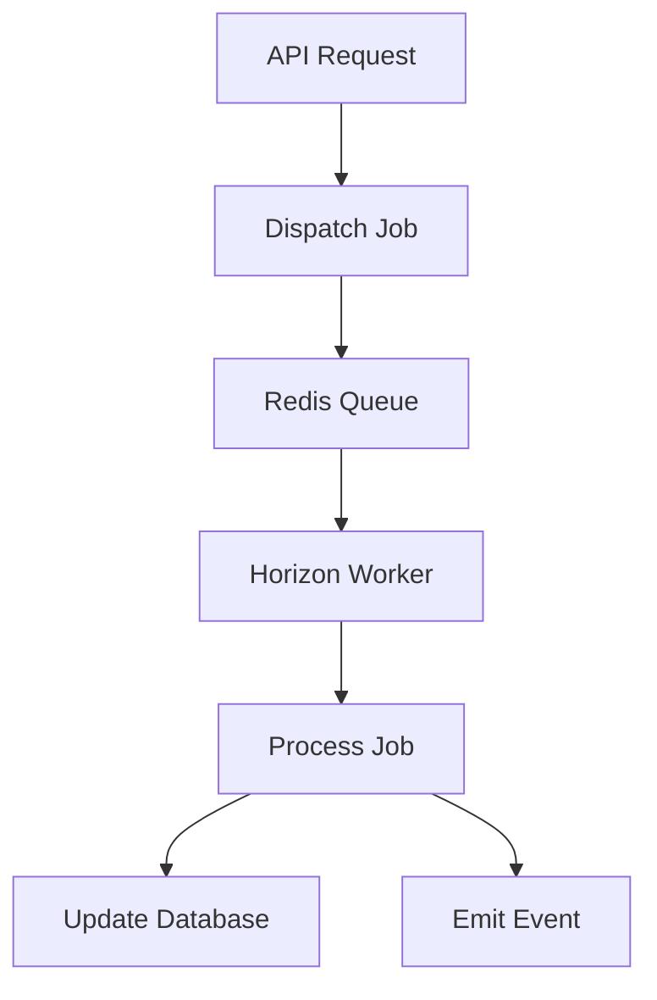
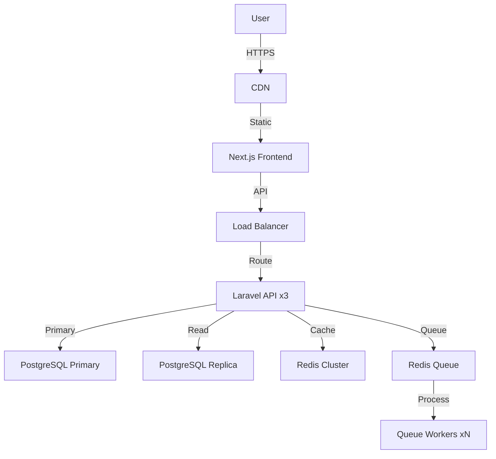
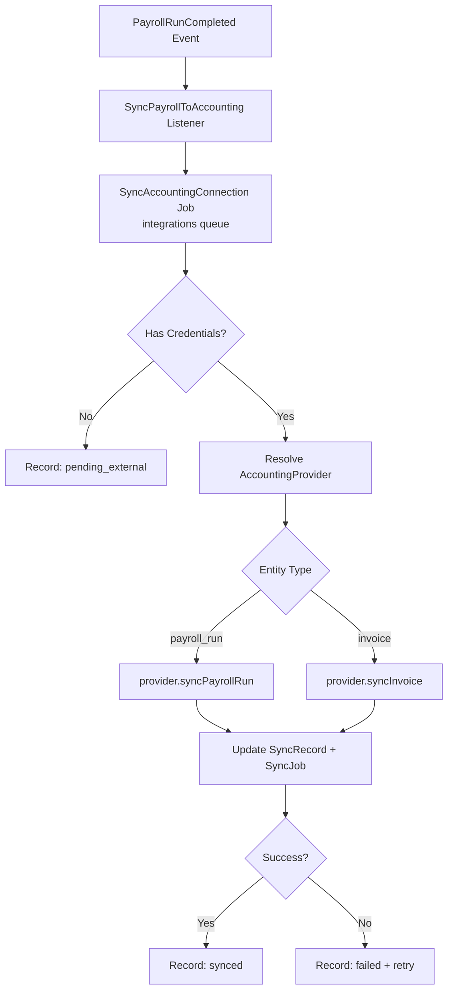

# PayrollFiti System Design

> **Complete technical architecture documentation for PayrollFiti**

## Table of Contents

1. [System Overview](#1-system-overview)
2. [Architecture Diagrams](#2-architecture-diagrams)
3. [Monorepo Architecture](#3-monorepo-architecture)
4. [Backend Architecture](#4-backend-architecture)
5. [Frontend Architecture](#5-frontend-architecture)
6. [Database Architecture](#6-database-architecture)
7. [Multi-Tenancy Architecture](#7-multi-tenancy-architecture)
8. [Payroll Architecture](#8-payroll-architecture)
9. [Compliance Architecture](#9-compliance-architecture)
10. [Authentication Architecture](#10-authentication-architecture)
11. [Queue Architecture](#11-queue-architecture)
11a. [Billing & Payments Architecture](#11a-billing--payments-architecture)
 11b. [Notifications Architecture](#11b-notifications-architecture)
 11c. [Accounting Integrations Architecture](#11c-accounting-integrations-architecture)
 12. [Security Boundaries](#12-security-boundaries)
 13. [Scalability Strategy](#13-scalability-strategy)
 14. [Deployment Architecture](#14-deployment-architecture)
 15. [Design Decisions](#15-design-decisions)

---

## 1. System Overview

PayrollFiti is a **multi-tenant SaaS payroll management system** designed for African businesses, with a focus on statutory compliance, deterministic calculations, and historical reproducibility.

### Core Principles

1. **Statutory Correctness**: Accurate country-specific tax and compliance rules
2. **Deterministic Payroll**: Same inputs always produce same outputs  
3. **Historical Reproducibility**: Past payroll runs remain unchanged
4. **Tenant Isolation**: Complete data separation between tenants
5. **Country-Specific Rules**: Extensible architecture for multiple countries
6. **Versioned Rules**: Rule sets versioned for historical accuracy
7. **Auditability**: All operations tracked and reproducible

---

## 2. Architecture Diagrams

### System Architecture (Mermaid)



### Multi-Tenancy Flow



### Payroll Flow



### Compliance Flow



### Queue Flow



### Deployment Flow



---

## 3. Monorepo Architecture

### Structure

```
payrollfiti/
├── apps/
│   ├── api/                 # Laravel Backend
│   │   ├── app/
│   │   │   ├── Domain/      # Business logic
│   │   │   ├── Http/        # HTTP layer
│   │   │   ├── Models/      # Data layer  
│   │   │   └── Policies/    # Authorization
│   │   ├── bootstrap/
│   │   ├── config/
│   │   ├── database/
│   │   ├── routes/
│   │   └── tests/
│   │
│   └── web/                 # Next.js Frontend
│       ├── pages/
│       ├── components/
│       ├── lib/
│       └── hooks/
│
├── docker-compose.yml
├── Dockerfile
├── .env.example
└── docs/
```

### Why Monorepo?

**Decision**: Use monorepo for shared code, easier testing, and unified deployment  
**Alternatives**: Separate repos for API and frontend  
**Why Chosen**: 
- Shared configuration (Docker, CI/CD)
- Single deployment unit
- Easier cross-component testing
- Unified dependency management
- Simpler local development

**Trade-offs**:
- Larger repository size
- Single build/deploy process
- Coupled versioning

---

## 4. Backend Architecture

### Laravel Structure

```
app/
├── Domain/                          # Domain Layer
│   ├── Payroll/                      # Payroll Domain
│   │   ├── Application/              # Use Cases
│   │   │   └── Commands/
│   │   │       └── RunPayrollCommand.php
│   │   └── Engine/                   # Core Engine
│   │       ├── RuleRegistry.php      # Rule resolution
│   │       ├── PayrollCalculator.php  # Calculation
│   │       └── Rules/                # Country rules
│   │
│   └── Compliance/                  # Compliance Domain
│       ├── ComplianceReportService.php
│       ├── CountryComplianceRegistry.php
│       └── Generators/               # Country generators
│
├── Http/                            # Application Layer
│   ├── Controllers/
│   │   └── Api/V1/                   # Versioned API
│   ├── Requests/                    # Form validation
│   └── Resources/                   # API responses
│
├── Models/                         # Data Layer
│   ├── Concerns/                    # Shared traits
│   │   └── BelongsToTenant.php
│   ├── Scopes/                      # Query scopes
│   │   └── TenantScope.php
│   └── *.php                        # Model classes
│
├── Policies/                       # Authorization
│   └── *.php
│
└── Support/                        # Utilities
    └── TenantContext.php
```

### Layer Responsibilities

| Layer | Responsibility | Examples |
|-------|----------------|----------|
| **Domain** | Business logic, rules | PayrollCalculator, RuleRegistry |
| **Application** | Use cases, commands | RunPayrollCommand |
| **HTTP** | Request/response handling | Controllers, Requests, Resources |
| **Data** | Database interaction | Models, Migrations |
| **Authorization** | Access control | Policies, Permissions |

---

## 5. Frontend Architecture

### Next.js Structure

```
apps/web/
├── pages/
│   ├── api/                        # API routes
│   ├── app/                       # App directory (Next.js 14+)
│   │   ├── compliance/
│   │   │   ├── reports/           # Compliance reports
│   │   │   │   ├── [id].tsx       # Report detail
│   │   │   │   └── index.tsx     # Report list
│   │   │   └── generate.tsx      # Generate report
│   │   ├── payroll/
│   │   │   ├── runs/             # Payroll runs
│   │   │   └── ...
│   │   └── ...
│   └── _app.tsx                   # App root
│   └── _document.tsx              # Document
│
├── components/
│   ├── compliance/
│   │   ├── ComplianceReportCard.tsx
│   │   └── ...
│   ├── payroll/
│   │   └── ...
│   └── ui/                       # UI primitives
│
├── lib/
│   ├── api/                       # API client
│   │   ├── compliance.ts           # Compliance API
│   │   └── payroll.ts              # Payroll API
│   ├── hooks/
│   │   ├── useComplianceReports.ts
│   │   └── usePayrollRuns.ts
│   └── utils/
│
├── styles/
└── types/
```

### State Management

**Tool**: React Query  
**Pattern**: Server state caching with automatic synchronization  

```typescript
// useComplianceReports.ts
import { useQuery } from '@tanstack/react-query';
import { getComplianceReports } from '@/lib/api/compliance';

export function useComplianceReports(companyId?: string) {
  return useQuery({
    queryKey: ['compliance-reports', companyId],
    queryFn: () => getComplianceReports({ companyId }),
  });
}
```

---

## 6. Database Architecture

### PostgreSQL Design

**Database**: PostgreSQL 15+  
**Schema**: Shared-schema multi-tenancy  
**RLS**: Row-Level Security for tenant isolation  

### Schema Structure

```
┌─────────────────────────────────────────────────────────┐
│                    Multi-Tenant Schema                      │
├─────────────────────────────────────────────────────────┤
│                                                             │
│  tenants (1)────┬───companies (N)────┬───employees (N)   │
│                 │                    │                    │
│                 │                    └───payroll_runs (N)─┘
│                 │                            │           │
│                 │                            └───payroll_entries (N)│
│                 │                                          │
│                 └────compliance_reports (N)───────────────┘
│                                                             │
│  users (N)─────┬───personal_access_tokens (N)             │
│                │                                            │
│                └───model_has_roles (N)────roles (N)──────┘
│                        │                                    │
│                        └───role_has_permissions (N)────permissions (N)
│                                                             │
└─────────────────────────────────────────────────────────┘
```

### Key Tables

#### Tenancy Tables
- `tenants`: Tenant organizations with default settings
- `companies`: Company entities within tenants
- `users`: Application users with tenant association

#### Payroll Tables
- `payroll_periods`: Payroll frequency periods
- `payroll_runs`: Payroll execution runs with idempotency hash
- `payroll_entries`: Individual employee payroll results
- `payroll_entry_items`: Detailed line items for entries

#### Compliance Tables
- `compliance_reports`: Generated compliance reports with country-specific data

#### HR Tables
- `employees`: Employee records
- `departments`, `positions`, `work_locations`: Organizational structure
- `salary_structures`, `salary_structure_components`: Compensation structure

### Indexing Strategy

All tables have appropriate indexes:
- Primary keys: UUID with index
- Foreign keys: Indexed for join performance
- Common query fields: Indexed (tenant_id, company_id, status, etc.)
- Composite indexes: For frequent query patterns

---

## 7. Multi-Tenancy Architecture

### Strategy: Shared-Schema with RLS

**Approach**: 
1. All tables include `tenant_id` column
2. Global scopes automatically filter by tenant
3. PostgreSQL RLS policies provide database-level enforcement
4. Tenant context set per-request

### Tenant Context Flow

```
Request
  ↓
Sanctum Auth Middleware → Identify User
  ↓
SetCurrentTenantContext Middleware → Extract tenant_id from user
  ↓
TenantContext::set() → Set PHP static property + PostgreSQL config
  ↓
Database Query → RLS policies filter by current_setting('app.current_tenant_id')
  ↓
Result → Only tenant's data returned
```

### RLS Policy Example

```sql
-- Enable RLS on table
ALTER TABLE employees ENABLE ROW LEVEL SECURITY;

-- Policy: Only allow access to tenant's own employees
CREATE POLICY tenant_isolation_policy ON employees
    FOR ALL
    USING (tenant_id = current_setting('app.current_tenant_id')::uuid);
```

### Global Scope Example

```php
// TenantScope.php
class TenantScope implements Scope
{
    public function apply(Builder $builder, Model $model)
    {
        $tenantId = TenantContext::current();
        if ($tenantId !== null) {
            $builder->where($model->getQualifiedTenantIdColumn(), $tenantId);
        }
    }
}
```

### Tenant Context Implementation

```php
// TenantContext.php
class TenantContext
{
    protected static ?string $tenantId = null;
    
    public static function set(?string $tenantId): void
    {
        static::$tenantId = $tenantId;
        
        if ($tenantId !== null && DB::getDriverName() === 'pgsql') {
            DB::statement("SELECT set_config('app.current_tenant_id', ?, false)", [$tenantId]);
        }
    }
    
    public static function current(): ?string
    {
        // Try static property first
        if (static::$tenantId !== null) {
            return static::$tenantId;
        }
        
        // Fall back to authenticated user
        $user = request()?->user() ?? Auth::user();
        return $user?->tenant_id ?: null;
    }
}
```

---

## 8. Payroll Architecture

### Design Overview

**Key Principles**:
- **Deterministic**: Same inputs produce same outputs
- **Country-specific**: Rule sets per country
- **Versioned**: Rule sets have effective dates
- **Idempotent**: Duplicate requests don't duplicate work
- **Auditable**: All inputs preserved for reproducibility

### Architecture Diagram

```
┌─────────────────────────────────────────────────────────┐
│                    Payroll Engine                            │
├─────────────────────────────────────────────────────────┤
│                                                             │
│  RunPayrollCommand                                          │
│  ┌────────────────────────────────────────────────────┐ │
│  │ 1. Validate request input                               │ │
│  │ 2. Calculate input hash for idempotency                 │ │
│  │ 3. Check for existing run with same hash              │ │
│  │ 4. For each employee:                                  │ │
│  │    a. Build PayrollInput DTO                           │ │
│  │    b. Resolve CountryRuleSet from RuleRegistry        │ │
│  │    c. Call PayrollCalculator.calculate()               │ │
│  │    d. Persist PayrollEntry                             │ │
│  │ 5. Return PayrollRun with entries                     │ │
│  └────────────────────────────────────────────────────┘ │
│                                                             │
│  PayrollCalculator                                         │
│  ┌────────────────────────────────────────────────────┐ │
│  │ 1. Calculate earnings (basic + allowances)            │ │
│  │ 2. Calculate tax using CountryRuleSet.taxCalculator() │ │
│  │ 3. Calculate deductions from CountryRuleSet.deductions│ │
│  │ 4. Calculate net pay                                    │ │
│  │ 5. Return PayrollResult DTO                           │ │
│  └────────────────────────────────────────────────────┘ │
│                                                             │
│  RuleRegistry                                               │
│  ┌────────────────────────────────────────────────────┐ │
│  │ 'KE' => [Kenya2024RuleSet, Kenya2025RuleSet]          │ │
│  │ 'NG' => [Nigeria2024RuleSet]                          │ │
│  │ 'ZA' => [SouthAfrica2024RuleSet]                     │ │
│  │ ...                                                   │ │
│  │                                                         │ │
│  │ resolve(countryCode, effectiveDate)                    │ │
│  │  1. Find all rule sets for country                    │ │
│  │  2. Filter by effective date                           │ │
│  │  3. Return most recent applicable                      │ │
│  └────────────────────────────────────────────────────┘ │
│                                                             │
│  CountryRuleSet                                             │
│  ┌────────────────────────────────────────────────────┐ │
│  │ + countryCode(): string                                │ │
│  │ + version(): string                                    │ │
│  │ + effectiveFrom(): DateTimeImmutable                  │ │
│  │ + effectiveTo(): ?DateTimeImmutable                    │ │
│  │ + deductions(): array<Deduction>                      │ │
│  │ + taxCalculator(): TaxCalculator                      │ │
│  └────────────────────────────────────────────────────┘ │
│                                                             │
└─────────────────────────────────────────────────────────┘
```

### Idempotency Mechanism

```php
// RunPayrollCommand.php
private function calculateInputHash(RunPayrollRequest $request): string
{
    $data = [
        $request->company_id,
        $request->payroll_period_id,
        $request->period_start,
        $request->period_end,
        $request->employee_ids,
        $request->allowances,
        $request->voluntary_deductions,
    ];
    
    return hash('sha256', serialize($data));
}

// Check for existing run
$existingRun = PayrollRun::where('input_hash', $inputHash)->first();
if ($existingRun) {
    return $existingRun; // Return existing, no duplication
}
```

### Historical Reproducibility

**Mechanism**:
1. `input_hash` captures all calculation inputs
2. `rule_version` stored with payroll run
3. `input_snapshot` preserves full request data
4. Country rule sets are versioned and dated

**Result**: Re-running the same payroll with the same effective date produces identical results, even if rules have changed since.

---

## 9. Compliance Architecture

### Design Overview

**Key Principles**:
- **Country-gated**: Only generate reports for company's country
- **Template-driven**: Each country has custom report format
- **Consumes persisted data**: Never recalculates payroll
- **Deterministic**: Same payroll run always produces same report
- **Versioned**: Report versions tracked with rule versions

### Architecture Diagram

```
┌─────────────────────────────────────────────────────────┐
│                   Compliance System                         │
├─────────────────────────────────────────────────────────┤
│                                                             │
│  ComplianceReportController                                  │
│  ┌────────────────────────────────────────────────────┐ │
│  │ POST /api/v1/compliance/reports                         │ │
│  │   1. Authorize (compliance.generate)                    │ │
│  │   2. Validate payroll_run_id                             │ │
│  │   3. Load PayrollRun and check access                   │ │
│  │   4. Call ComplianceReportService.generateForPayrollRun  │ │
│  │   5. Return ComplianceReportResource                    │ │
│  └────────────────────────────────────────────────────┘ │
│                                                             │
│  ComplianceReportService                                    │
│  ┌────────────────────────────────────────────────────┐ │
│  │ generateForPayrollRun(payrollRun, reportCode):           │ │
│  │   1. Load company from payroll run                      │ │
│  │   2. Get country code from company                      │ │
│  │   3. Resolve generator from CountryComplianceRegistry   │ │
│  │   4. Generate report payload from payroll entries        │ │
│  │   5. Persist report (idempotent)                        │ │
│  │   6. Return ComplianceReport model                      │ │
│  └────────────────────────────────────────────────────┘ │
│                                                             │
│  CountryComplianceRegistry                                 │
│  ┌────────────────────────────────────────────────────┐ │
│  │ Generators:                                             │ │
│  │   KenyaComplianceGenerator     → KE-P9               │ │
│  │   NigeriaComplianceGenerator    → NG-PAYE            │ │
│  │   SouthAfricaComplianceGenerator → ZA-PAYE          │ │
│  │   UgandaComplianceGenerator    → UG-PAYE            │ │
│  │                                                           │ │
│  │ resolve(countryCode, reportCode)                        │ │
│  │   - Finds generator matching country AND report code   │ │
│  │   - Throws UnsupportedComplianceCountryException       │ │
│  └────────────────────────────────────────────────────┘ │
│                                                             │
│  AbstractCountryComplianceGenerator                        │
│  ┌────────────────────────────────────────────────────┐ │
│  │ generate(payrollRun):                                   │ │
│  │   1. Load payroll entries with employee               │ │
│  │   2. Transform each entry to report row                 │ │
│  │   3. Calculate totals from all entries                  │ │
│  │   4. Return report payload with metadata               │ │
│  │                                                         │ │
│  │ Report Format:                                          │ │
│  │   report_code: string                                   │ │
│  │   report_version: string                                │ │
│  │   country: string                                       │ │
│  │   rows: array                                          │ │
│  │   totals: array                                        │ │
│  │   metadata: array                                       │ │
│  │     - template: string                                 │ │
│  │     - source: 'persisted_payroll_entries'              │ │
│  │     - source_payroll_run_id: uuid                      │ │
│  │     - country: string                                  │ │
│  │     - period_start/end: date                           │ │
│  │     - rule_version: string                             │ │
│  └────────────────────────────────────────────────────┘ │
│                                                             │
└─────────────────────────────────────────────────────────┘
```

### Country-Specific Generators

```php
// KenyaComplianceGenerator.php
final class KenyaComplianceGenerator extends AbstractCountryComplianceGenerator
{
    public function countryCode(): string { return 'KE'; }
    public function reportCode(): string { return 'KE-P9'; }
    public function version(): string { return 'KE-2025.1'; }
}

// NigeriaComplianceGenerator.php  
final class NigeriaComplianceGenerator extends AbstractCountryComplianceGenerator
{
    public function countryCode(): string { return 'NG'; }
    public function reportCode(): string { return 'NG-PAYE'; }
    public function version(): string { return 'NG-2025.1'; }
}

// SouthAfricaComplianceGenerator.php
final class SouthAfricaComplianceGenerator extends AbstractCountryComplianceGenerator
{
    public function countryCode(): string { return 'ZA'; }
    public function reportCode(): string { return 'ZA-PAYE'; }
    public function version(): string { return 'ZA-2025.1'; }
}

// UgandaComplianceGenerator.php (4th country)
final class UgandaComplianceGenerator extends AbstractCountryComplianceGenerator
{
    public function countryCode(): string { return 'UG'; }
    public function reportCode(): string { return 'UG-PAYE'; }
    public function version(): string { return 'UG-2025.1'; }
}
```

### Data Flow

```
User Request (POST /api/v1/compliance/reports)
     ↓
Authentication (Sanctum)
     ↓
Authorization (ComplianceReportPolicy)
     ↓
Tenant Context (SetCurrentTenantContext)
     ↓
Controller (validate, load payroll run)
     ↓
ComplianceReportService.generateForPayrollRun()
     ↓
Company.country → CountryComplianceRegistry.resolve()
     ↓
CountryComplianceGenerator.generate()
     ↓
PayrollRun.entries() → Collection of PayrollEntry
     ↓
Transform to report rows + calculate totals
     ↓
Build report payload with metadata
     ↓
Persist ComplianceReport (idempotent upsert)
     ↓
Return ComplianceReportResource
```

### Idempotency

Compliance reports are idempotent at the (tenant_id + company_id + payroll_run_id + report_code + report_version) level:

```sql
-- In migration
$table->unique([
    'tenant_id', 
    'company_id', 
    'payroll_run_id', 
    'report_code', 
    'report_version'
], 'compliance_reports_unique_run_report');
```

```php
// In service
$report = ComplianceReport::query()
    ->where('tenant_id', $payrollRun->tenant_id)
    ->where('company_id', $company->id)
    ->where('payroll_run_id', $payrollRun->id)
    ->where('report_code', $payload['report_code'])
    ->where('report_version', $payload['report_version'])
    ->first();

if ($report !== null) {
    $report->fill($attributes);
    $report->save();
    return $report; // Update existing
}

return ComplianceReport::create($attributes); // Create new
```

---

## 10. Authentication Architecture

### Architecture

**Tool**: Laravel Sanctum  
**Pattern**: Token-based + Session-based authentication  

```
┌─────────────────────────────────────────────────────────┐
│                    Authentication                          │
├─────────────────────────────────────────────────────────┤
│                                                             │
│  Session-Based Auth                                        │
│  ┌────────────────────────────────────────────────────┐ │
│  │ 1. User submits email/password                         │ │
│  │ 2. Auth::attempt() validates credentials                │ │
│  │ 3. Session regenerated                                  │ │
│  │ 4. User authenticated, tenant context set              │ │
│  │ 5. Session cookie returned                             │ │
│  └────────────────────────────────────────────────────┘ │
│                                                             │
│  Token-Based Auth                                         │
│  ┌────────────────────────────────────────────────────┐ │
│  │ 1. User requests token via /sanctum/token              │ │
│  │ 2. PersonalAccessToken created with abilities         │ │
│  │ 3. Token returned (plaintext, one-time)                 │ │
│  │ 4. Client stores token securely                        │ │
│  │ 5. Client sends token in Authorization header           │ │
│  │ 6. Sanctum validates token                              │ │
│  │ 7. User authenticated, tenant context set              │ │
│  └────────────────────────────────────────────────────┘ │
│                                                             │
└─────────────────────────────────────────────────────────┘
```

### Session Security

```php
// Login flow with CSRF protection
public function login(LoginRequest $request)
{
    $credentials = $request->validated();
    
    if (Auth::attempt($credentials)) {
        $request->session()->regenerate(); // Prevent session fixation
        
        return response()->json([
            'user' => $request->user(),
            'tenant_id' => $request->user()->tenant_id,
        ]);
    }
    
    return response()->json(['message' => 'Invalid credentials'], 422);
}
```

### Token Security

```php
// Creating token with abilities
$token = $user->createToken('api-token', [
    'payroll.view',
    'compliance.generate',
]);

// Token is hashed in database, plaintext returned once
return ['token' => $token->plainTextToken];
```

---

## 11. Queue Architecture

> Full reference: [QUEUES_AND_REDIS.md](./QUEUES_AND_REDIS.md)

### Architecture

**Tool**: Laravel Queues + Redis + Horizon  
**Dispatch guarantee**: `after_commit => true` (jobs dispatched inside a DB
transaction are only published to Redis after the transaction commits)

```
┌─────────────────────────────────────────────────────────┐
│                    Queue System                         │
├─────────────────────────────────────────────────────────┤
│  Guaranteed dispatch                                     │
│  ┌────────────────────────────────────────────────────┐ │
│  │ State change + outbox INSERT in one DB transaction │ │
│  │ → commit → outbox relay (every 5s) → event()       │ │
│  │ → 4 queued listeners → Redis                      │ │
│  └────────────────────────────────────────────────────┘ │
│                                                         │
│  Queue Connection (Redis)                               │
│  ┌────────────────────────────────────────────────────┐ │
│  │ One queue per concern:                             │ │
│  │ payroll, notifications, webhooks, integrations,    │ │
│  │ high, default, email, sms, reports, exports        │ │
│  └────────────────────────────────────────────────────┘ │
│                                                         │
│  Horizon (monitoring + workers)                         │
│  ┌────────────────────────────────────────────────────┐ │
│  │ supervisor-default, -payroll, -email, -webhooks,   │ │
│  │ -integrations with per-queue tries/backoff/timeout │ │
│  │ balance=auto redirects idle capacity to payroll    │ │
│  │ queues under end-of-month burst load               │ │
│  └────────────────────────────────────────────────────┘ │
│                                                         │
└─────────────────────────────────────────────────────────┘
```

### Transactional Outbox (→ design decision D13.1 below)

Money events — payroll-run completion and payment settlement — are written to
`outbox_events` in the **same DB transaction** as the state change, then relayed by
the `queue:dispatch-outbox` schedule:

```
FinalizePayrollRun / PaymentSettled
  → [DB txn] mutate state + INSERT outbox_events   (atomic)
  → commit
  → OutboxDispatcher (every 5s) claims rows FOR UPDATE, maps event_type → domain
    event, event($event)
  → fan-out: PayrollRunCompleted → 4 queued listeners on 4 queues; PaymentSettled
    → DispatchOutboundWebhooks
```

`Payload` is `jsonb`; unknown event types dead-letter (`attempts`/`last_error`)
instead of being silently swallowed. The relay is safe to run on multiple scheduler
nodes (exclusive row claim).

### Event fan-out & tenant-aware jobs

- `EventServiceProvider::$listen` (explicit map; discovery disabled via
  `withEvents(discover: false)`).
- Queued listeners push onto dedicated queues (`payroll`/`notifications`/`webhooks`/
  `integrations`) so one slow consumer never stalls the others.
- `TenantAwareJob` base sets `TenantContext` from the job payload and clears it in
  `finally`; every queued job runs with the correct tenant scope and never leaks it.
- `GeneratePayslips` fans one completed run out into **one `GeneratePayslip` job per
  payroll entry** (`chunkById`), skipping entries that already have a payslip —
  idempotent under re-dispatch.
- Webhook delivery signs outbound payloads (HMAC-SHA256) and records every attempt
  in `webhook_delivery_logs`; retries/failure handled by the `webhooks` supervisor
  (6 tries, exponential backoff).

### Current Usage (Part 13)

Async processing is used for (all queue-backed, tested in `QueueMessagingTest`):
- **Payslip generation** — one job per payroll entry on `payroll`
- **Notifications** — completion/heartbeat notification writes on `notifications`
- **Webhooks** — outbound delivery + inbound provider events on `webhooks`
- **Accounting sync** — `SyncAccountingConnection` on `integrations`
- **Scope for future work** — compliance report generation, exports on their
  dedicated queues

---

## 11a. Billing & Payments Architecture

### Overview

Billing/Payments follows the same domain-first, tenant-isolated structure as Payroll and Compliance. All monetary math uses **bcmath string arithmetic** (`app/Support/Money.php`) — no floats (rule: floats are never authoritative for money).

```
                         ┌────────────────────────────────────────────┐
                         │               PaymentProviders              │
                         │  PaymentProviderManager (registered in      │
                         │  PaymentServiceProvider, alias payments.manager)
                         │                                            │
                         │  ┌──────────────┐    ┌──────────────────┐   │
                         │  │ Paystack     │    │ M-Pesa (Daraja)  │   │
                         │  │ SHA-512 HMAC │    │ x-callback-token │   │
                         │  │ kobo/minor   │    │ OAuth + STK Push │   │
                         │  └──────┬───────┘    └────────┬─────────┘   │
                         └─────────┼──────────────────────┼────────────┘
                                   │                      │
   POST /api/v1/webhooks/{provider}│                      │
   ┌───────────────────────────────▼──────────────────────▼──────┐
   │ WebhookController (unauthenticated, no tenant context)      │
   │  1. verify signature (HMAC / x-callback-token) → else 400  │
   │  2. parse WebhookEvent                                       │
   │  3. firstOrCreate payment_provider_events                    │
   │     keyed (provider, provider_event_id) → replay protection │
   │  4. dispatch ProcessPaymentWebhook on 'webhooks' queue      │
   └───────────────────────────────┬──────────────────────────────┘
                                   │
   ProcessPaymentWebhook (worker, no tenant context)
   ┌───────────────────────────────▼──────────────────────────────┐
   │ 1. load event via withoutTenantScope()                       │
   │ 2. extract reference pay_{tenant}_{uuid} → tenant id         │
   │ 3. TenantContext::set($tenantId)   … finally clear()         │
   │ 4. transition PaymentTransaction by idempotency_key          │
   │ 5. on success: settle invoice (status='paid', paid_at)       │
   │ 6. mark event processed (or skipped when unmatched)          │
   └──────────────────────────────────────────────────────────────┘

   Authenticated billing API (sanctum; billing.view / billing.manage; policies)
   ┌────────────────────────────────────────────────────────────────┐
   │ GET    billing/plans                    → PlanController       │
   │ GET    billing/subscription             → SubscriptionController│
   │ GET    billing/invoices                 → InvoiceController     │
   │ GET    billing/invoices/{invoice}       → InvoiceController     │
   │ POST   billing/invoices/{invoice}/payments → PaymentController  │
   │ GET    billing/payments/{paymentTransaction} → PaymentController│
   └────────────────────────────────────────────────────────────────┘

   Scheduled commands (routes/console.php; per-tenant loop, RLS-safe)
   ┌──────────────────┬─────────────────────────────────────────────┐
   │ payments:reconcile-pending              every 15 minutes       │
   │   → processing txs >5min → provider reconcilePayment → state   │
   │ billing:process-subscription-renewals   daily 02:00            │
   │   → active subs ends_at<=now → bcmath invoice → extends ends_at│
   │   → idempotent via partial unique index (subscription, period) │
   └──────────────────┴─────────────────────────────────────────────┘
```

### Payment State Machine

`PaymentTransaction::transitionTo()` enforces:

- `pending → processing → {succeeded, failed, expired}`
- Terminal states (`succeeded`, `failed`, `expired`) are **immutable**; a duplicate provider delivery to a terminal state is a **no-op** that preserves earlier provider tracking.
- `succeeded`/`failed` transitions dispatch `PaymentSucceeded` / `PaymentFailed` domain events.

### Idempotency & Replay Protection

| Layer | Mechanism |
|-------|-----------|
| Payment initiation | `pay_{tenant}_{uuid}` reference reused while a transaction is `pending` (dedupe on `idempotency_key`) |
| Webhook intake | Unique `(provider, provider_event_id)`; `firstOrCreate`; re-dispatch only when new or previously `received` |
| Webhook processing | Event status guards (`processed`/`skipped` skip); transition to terminal is a no-op |
| Renewals | Partial unique index `invoices_subscription_billing_period_uq (subscription_id, billing_period_start) WHERE subscription_id IS NOT NULL`; `QueryException` catch → skip |

### Tenant Isolation

- All billing models use `BelongsToTenant` (global scope + auto-fill).
- Authenticated APIs resolve tenant from the authenticated user via `SetCurrentTenantContext` (now clears context in `finally` after every request).
- Webhook intake runs with **no** tenant context; rows are recorded with `tenant_id IS NULL` and matched to a tenant only inside the worker via the embedded tenant token in the payment reference (permissive null-tenant RLS policies on `payment_provider_events`).
- Scheduled commands iterate `tenants` and set `TenantContext::set()` per tenant inside `try/finally` — safe because `tenants` is not RLS-policied.

### Authorization

- `InvoicePolicy`: `viewAny`/`view` (billing.view or billing.manage), `pay` (billing.manage + tenant match).
- `PaymentTransactionPolicy::view`: tenant match + billing.view/manage.
- Cross-tenant resource reads resolve to **404** via tenant-scoped route model binding (no existence leak).

### Files

- `app/Domain/Payments/**` (contracts, manager, events, exceptions), `app/Infrastructure/Payments/**` (CurlClient, PaystackProvider, MpesaProvider), `app/Support/Money.php`
- `app/Models/{Plan,Subscription,Invoice,UsageRecord,PaymentTransaction,PaymentProviderEvent}.php`
- `app/Jobs/ProcessPaymentWebhook.php`, `app/Http/Controllers/Api/V1/WebhookController.php`, `app/Http/Controllers/Api/V1/Billing/*.php`, `app/Policies/{InvoicePolicy,PaymentTransactionPolicy}.php`
- `app/Console/Commands/{ReconcilePendingPaymentsCommand,ProcessSubscriptionRenewalsCommand}.php`, `routes/console.php`
- `app/Providers/PaymentServiceProvider.php`, `bootstrap/app.php`, `config/services.php`
- `database/migrations/2026_09_12_000020_complete_billing_support.php`
- `tests/Feature/BillingPaymentsTest.php`

---

## 11b. Notifications Architecture

### Overview

Notifications follow a strict business-event → domain-event → dispatcher → queue →
channel → provider → delivery-tracking pipeline. No part of the domain layer knows
about a channel; `NotificationDispatcher` decides *who* gets notified (preferences +
role gating) and *where* each notification goes. Delivery is transport-agnostic and
fully asynchronous via a dedicated `notifications` queue.

```
Business event (PayrollRunCompleted, PaymentSucceeded, ComplianceReportGenerated, Auth\Login, …)
        │  domain event dispatched
        ▼
Listener (Notify* — resolves recipients, builds payload, describes entity key)
        │  NotificationDispatcher::notify(recipients[], event_type, data, entity_key)
        ▼
NotificationDispatcher
  ├─ idempotency: (recipient, event_type, entity_key) → skip if already notified
  ├─ preference gate: resolved channels = user prefs ∩ defaults  (empty ⇒ skip user)
  ├─ TemplateRenderer: safe substitution (allow-list, fallback template)
  └─ persists Notification (user-owned) + NotificationDelivery per channel
        │  SendNotificationDelivery job per delivery (notifications queue, tenant-aware)
        ▼
Channel (Email/Sms/Push/…enabledChannels) → Provider (Mail/SmsProvider/PushProvider)
        ▼
NotificationDelivery: queued → sent → delivered(ack) | failed(retryable) → give-up → failed
```

### Design Highlights

- **Schema** (Part 5 migration): `notifications`, `notification_deliveries`,
  `notification_preferences`, `notification_templates`, `push_subscriptions`. Additive
  `dedupe_hash` on `notifications` supports entity-key idempotency; partial unique index
  scopes it to `(user_id, event_type)` where `entity_key IS NOT NULL`.
- **Event types** (`NotificationTypes`): dotted keys (`payroll.run_completed`,
  `billing.payment.succeeded`, …) each mapped to a category (`auth`, `payroll`,
  `billing`, `compliance`, `hr`) with code-level default channels. Defaults lean
  explicit: `in_app` + `email` on, `sms` + `push` off until a user opts in
  (SMS additionally requires a phone number the dispatcher can never invent).
- **Preferences**: `GET/PUT /notification-preferences`; a `PUT` accepts one object or an
  array of `{ event_type, in_app?, email?, sms?, push? }`, fills only provided channels,
  and returns the full resolved list (unknown types a user has opted into are surfaced).
- **Rendering**: `TemplateRenderer` interpolates only variables declared in each template
  (`{{variable}}`, not raw Blade); missing templates fall back to a generic title/body.
- **Recipients**: payroll/compliance notify the initiating user (stored on the run/report);
  billing notifies all active subscribers; login notifications target the just-authenticated
  user and are deliberately synchronous so the session id is readable.

### Delivery Lifecycle

- `SendNotificationDelivery` (`TenantAwareJob`, queue `notifications`, 3 tries w/ backoff):
  transports that throw (no phone, provider error) are **rethrown** so the job retries;
  the delivery keeps status `queued` with `attempts`, `last_error`, `failed_at`.
- The queue giving up calls `failed()` → delivery dead-letters to `failed`.
- A `status` of `sent`/`delivered` is terminal for success; a retryable failure is a
  *resumable* `queued` (never re-dispatched deduped — the idempotency hash already exists).
- Providers are interfaces (`SmsProvider`, `PushProvider`) with dev-log implementations;
  `EmailChannel` uses Laravel Mail. Swapping the container binding before first resolve
  is the documented extension point for real Twilio/Nexmo and Web-Push vendors.

### API

- `GET /notifications` (`unreadOnly=true`, `take`) · `GET /notifications/{id}` ·
  `POST /notifications/{id}/read` · `POST /notifications/read-all`
- `GET/PUT /notification-preferences` · `GET /push-subscriptions/vapid-public-key` ·
  `POST/DELETE /push-subscriptions`
- All notification routes live **outside** the `v1` prefix in the `auth:sanctum` group,
  matching the Next.js client's root API base. `Notification` route binding is
  user-scoped in `AppServiceProvider` (404 for other users' rows).

### Security

- Every notification/preference/subscription row is user-scoped; `NotificationPolicy`
  enforces ownership (and tenant match) on top of the model scope.
- No special notification permission exists — any authenticated user manages their own.
- Cross-tenant notifications resolve to 404; the tenant-aware delivery job refuses to
  deliver when the serialized tenant id mismatches its context.

### Files

- `app/Domain/Notifications/**` (`NotificationTypes`, `ChannelRegistry`, `TemplateRenderer`,
  `NotificationDispatcher`, `NotificationChannel` contract, `EmailChannel`, `SmsChannel`,
  `PushChannel`, provider contracts + dev implementations)
- `app/Models/{Notification,NotificationTemplate,NotificationPreference,NotificationDelivery,PushSubscription}.php`
- `app/Jobs/SendNotificationDelivery.php`, `app/Listeners/{SendPayrollCompletionNotifications,NotifyPaymentSucceeded,NotifyPaymentFailed,NotifyComplianceReportReady,NotifyNewLogin}.php`
- `app/Http/Controllers/Api/V1/{NotificationController,NotificationPreferenceController,PushSubscriptionController}.php`,
  `app/Http/Resources/NotificationResource.php`, `app/Policies/NotificationPolicy.php`
- `app/Providers/NotificationServiceProvider.php`, `config/notifications.php`, `config/services.php` (vapid block)
- `database/seeders/NotificationTemplateSeeder.php`, `database/migrations/*…notifications*`
- `tests/Feature/NotificationSystemTest.php` (20 tests / 93 assertions)
- `apps/web/app/(app)/notifications/{page.tsx,preferences/page.tsx}`,
  `apps/web/lib/notifications-api.ts`, frontend `NotificationBell`/`PushNotificationToggle`

---

## 12. Security Boundaries

### Security Layers

```
┌─────────────────────────────────────────────────────────┐
│                    Security Layers                          │
├─────────────────────────────────────────────────────────┤
│                                                             │
│  Network Layer                                               │
│  ├─ HTTPS/TLS encryption                                     │
│  ├─ CORS restrictions                                        │
│  ├─ Rate limiting                                           │
│  └─ DDoS protection (infrastructure-level)                │
│                                                             │
│  Application Layer                                          │
│  ├─ Authentication (Sanctum)                                │
│  ├─ Authorization (Policies + Spatie)                       │
│  ├─ CSRF protection                                         │
│  ├─ Input validation                                        │
│  └─ Tenant isolation (Global scopes + RLS)                 │
│                                                             │
│  Data Layer                                                │
│  ├─ PostgreSQL RLS policies                                  │
│  ├─ Model-level tenant scoping                             │
│  ├─ Encryption at rest (configurable)                       │
│  └─ Audit logging (planned)                                │
│                                                             │
└─────────────────────────────────────────────────────────┘
```

### Tenant Isolation Boundaries

| Boundary | Implementation | Protection |
|----------|----------------|------------|
| **Model Queries** | BelongsToTenant trait | Automatic tenant filtering |
| **RLS Policies** | PostgreSQL policies | Database-level enforcement |
| **Policy Checks** | ComplianceReportPolicy | Explicit authorization |
| **Request Context** | TenantContext | Per-request tenant setting |
| **Route Middleware** | SetCurrentTenantContext | Context propagation |

### Security Rules

✅ **DO**:
- Always use `BelongsToTenant` trait on multi-tenant models
- Always verify tenant access in policies
- Always set tenant context for every request
- Use PostgreSQL RLS for critical queries
- Validate all user inputs
- Sanitize all outputs
- Use parameter binding
- Rate limit sensitive endpoints

❌ **DO NOT**:
- Trust `tenant_id` supplied by the client
- Bypass tenant scopes without explicit authorization
- Assume tenant context is set without checking
- Use raw SQL without tenant filtering
- Log sensitive employee data
- Expose internal implementation details in errors
- Store secrets in plain text

---

## 13. Scalability Strategy

### Scalability Path

#### Phase 1: Development / Small Production (Current)

```
Single Server:
┌─────────────────────────────────┐
│       Single Server               │
│  ┌─────────┐  ┌─────────┐  ┌─┐ │
│  │  Next.js │  │ Laravel  │  │DB│ │
│  └─────────┘  └─────────┘  └─┘ │
└─────────────────────────────────┘
```

**Capacity**: ~100-1,000 employees, ~10-50 tenants

#### Phase 2: Growing SaaS

```
Horizontal API Scaling:
┌─────────────────────────────────────────┐
│              Load Balancer                 │
└──────────────┬──────────────┬──────────┘
               │              │              │
      ┌────────▼──────┐ ┌────────▼──────┐ ┌─────▼─────┐
      │  Laravel API   │ │  Laravel API   │ │ PostgreSQL │
      │   Instance 1   │ │   Instance 2   │ │  Primary   │
      └───────────────┘ └───────────────┘ └─────┬─────┘
                                               │
                                      ┌────────▼───────┐
                                      │ PostgreSQL      │
                                      │  Replica        │
                                      └────────────────┘
```

**Capacity**: ~10,000-50,000 employees, ~100-500 tenants

#### Phase 3: Large Multi-Tenant Platform

```
Full Horizontal Scaling:
┌─────────────────────────────────────────────────────────┐
│                    Load Balancer                            │
└───────────────────────┬───────────────────────────────────┘
                        │
        ┌───────────────────┼───────────────────┐
        │                   │                   │
┌───────▼───────┐ ┌───────▼───────┐ ┌───────▼───────┐
│   Next.js      │ │   Laravel API  │ │   Laravel API  │
│   Instance 1   │ │   Instance 1   │ │   Instance 2   │
└───────┬───────┘ └───────┬───────┘ └───────┬───────┘
        │                   │                   │
        ▼                   ▼                   ▼
┌─────────────────────────────────────────────────────────┐
│                    PostgreSQL Cluster                      │
│  ┌─────────┐  ┌─────────┐  ┌─────────┐                  │
│  │ Primary │  │ Replica  │  │ Replica  │                  │
│  └─────────┘  └─────────┘  └─────────┘                  │
└─────────────────────────────────────────────────────────┘
                         │
        ┌────────────────────┼────────────────────┐
        │                    │                    │
┌───────▼───────┐ ┌────────▼───────┐ ┌────────▼───────┐
│   Redis       │ │   Redis         │ │   Queue Worker  │
│   Cache       │ │   Queue         │ │   Instance      │
└───────────────┘ └────────────────┘ └────────────────┘
```

**Capacity**: ~100,000+ employees, ~1,000+ tenants

### Scaling Components

| Component | Scaling Strategy | Trigger | Complexity |
|-----------|------------------|---------|------------|
| **API Servers** | Horizontal scaling + load balancer | 100+ concurrent users | Low |
| **Database** | Read replicas + connection pooling | 1,000+ employees | Medium |
| **Redis** | Cluster mode | High cache/queue volume | Medium |
| **Queue Workers** | Multiple workers, autoscaling | 100+ queued jobs | Low |
| **Frontend** | Multiple instances + CDN | 1,000+ users | Low |
| **Storage** | S3-compatible object storage | File uploads | Low |

### Bottlenecks and Solutions

| Bottleneck | Solution | When Needed |
|-----------|----------|-------------|
| API CPU | Add more API instances | High concurrent requests |
| Database CPU | Add read replicas, optimize queries | High read load |
| Database Connections | Connection pooling (PgBouncer) | Many concurrent queries |
| Queue Processing | Add more workers | Long job queues |
| Cache Memory | Redis cluster | Large cache datasets |
| Frontend Performance | CDN for static assets | Global users |

---

## 14. Deployment Architecture

### Development Deployment

```bash
# Start all services
docker compose up -d

# Run migrations
docker compose exec api php artisan migrate

# Generate key
docker compose exec api php artisan key:generate

# Start queue workers
docker compose exec api php artisan queue:work --daemon

# Start scheduler
docker compose exec api php artisan schedule:work

# Start Horizon (optional)
docker compose exec api php artisan horizon
```

### Production Deployment

```
Production Stack:
┌─────────────────────────────────────────────────────────┐
│                    Cloud Infrastructure                     │
├─────────────────────────────────────────────────────────┤
│                                                             │
│  Ingress Layer                                             │
│  ┌────────────────────────────────────────────────────┐ │
│  │                   CDN / Load Balancer                   │ │
│  │              (Cloudflare, AWS ALB, etc.)                │ │
│  └───────────────────────────────┬────────────────────┘ │
│                                  │                          │
│  ┌─────────────────────────────────▼────────────────────┐ │
│  │                  Next.js Frontend                       │ │
│  │                 (Auto-scaled instances)                  │ │
│  └─────────────────────────────────┬────────────────────┘ │
│                                  │                          │
│  ┌─────────────────────────────────▼────────────────────┐ │
│  │                  Laravel API                            │ │
│  │                 (Auto-scaled instances)                  │ │
│  │  ┌─────────────┐  ┌─────────────┐  ┌─────────────┐    │ │
│  │  │  Instance 1 │  │  Instance 2 │  │  Instance 3 │    │ │
│  │  └─────────────┘  └─────────────┘  └─────────────┘    │ │
│  └─────────────────────────────────┬────────────────────┘ │
│                                  │                          │
│  ┌─────────────────────────────────▼────────────────────┐ │
│  │                PostgreSQL Cluster                       │ │
│  │  ┌─────────────┐  ┌─────────────┐  ┌─────────────┐    │ │
│  │  │   Primary   │  │   Replica   │  │   Replica   │    │ │
│  │  └─────────────┘  └─────────────┘  └─────────────┘    │ │
│  │                                                     │ │
│  └─────────────────────────────────────────────────────┘ │
│                                                             │
│  ┌─────────────────────────────────┐                    │
│  │                Redis Cluster      │                    │
│  │  (Cache + Queue + Sessions)       │                    │
│  └─────────────────────────────────┘                    │
│                                                             │
│  ┌─────────────────────────────────┐                    │
│  │               MinIO Cluster       │                    │
│  │  (S3-compatible object storage)  │                    │
│  └─────────────────────────────────┘                    │
│                                                             │
│  ┌─────────────────────────────────┐                    │
│  │            Queue Workers           │                    │
│  │  (Auto-scaled based on queue depth)│                    │
│  └─────────────────────────────────┘                    │
│                                                             │
└─────────────────────────────────────────────────────────┘
```

### Docker Configuration

```yaml
# docker-compose.yml (development)
services:
  api:
    build: .
    ports: ["8000:80"]
    environment:
      - APP_ENV=local
      - DB_HOST=db
      - REDIS_HOST=redis
    depends_on: [db, redis, minio]

  web:
    build: ./apps/web
    ports: ["3000:3000"]

  db:
    image: postgres:15
    volumes: [pgdata:/var/lib/postgresql/data]

  redis:
    image: redis:7

  minio:
    image: minio/minio
    command: server /data --console-address ":9001"

  horizon:
    build: .
    command: php artisan horizon

  scheduler:
    build: .
    command: php artisan schedule:work

  mailpit:
    image: axllent/mailpit
```

---

## 15. Design Decisions

### Major Architectural Decisions

#### 1. Monorepo vs. Polyrepo

**Decision**: Monorepo  
**Problem**: Need shared configuration, easier testing, unified deployment  
**Alternatives**: Separate repos for API and frontend  
**Why Chosen**: 
- Single Docker Compose configuration
- Shared dependencies
- Unified CI/CD pipeline
- Easier local development
- Cross-component testing

**Trade-offs**:
- Larger repository
- Coupled versioning
- Single point of failure for builds

**When to Change**: If frontend and backend need independent deployment cycles

#### 2. Shared-Schema Multi-Tenancy

**Decision**: Shared database with tenant_id columns + RLS  
**Problem**: Need tenant isolation with PostgreSQL  
**Alternatives**: 
- Separate database per tenant (too expensive)
- Separate schema per tenant (complex migration)

**Why Chosen**:
- Cost-effective (single database)
- PostgreSQL RLS provides strong isolation
- Global scopes prevent accidental cross-tenant access
- Easier to query across tenants when needed

**Trade-offs**:
- All tenants share database resources
- Schema changes affect all tenants
- Potential for noisy neighbors

**When to Change**: If needing physical database separation for compliance

#### 3. Laravel Sanctum for Auth

**Decision**: Laravel Sanctum for API authentication  
**Problem**: Need simple, secure API authentication  
**Alternatives**: 
- Laravel Passport (OAuth2, more complex)
- JWT (stateless, no built-in session support)
- Custom token system

**Why Chosen**:
- Built into Laravel
- Simple to implement
- Supports both session and token auth
- Good security defaults

**Trade-offs**:
- Less feature-rich than Passport
- Tied to Laravel ecosystem

**When to Change**: If needing OAuth2 flows or third-party integrations

#### 4. Domain-Driven Design Structure

**Decision**: Organize code by domain (Payroll, Compliance)  
**Problem**: Need maintainable, extensible architecture  
**Alternatives**: 
- Traditional MVC (controllers get fat)
- Service-oriented architecture

**Why Chosen**:
- Business logic separated from infrastructure
- Easy to extend (new countries, new report types)
- Clear boundaries between domains
- Testable in isolation

**Trade-offs**:
- Slightly more abstraction
- Learning curve for DDD patterns

**When to Change**: If domains become too coupled or architecture becomes too complex

#### 5. Registry Pattern for Country Rules

**Decision**: Use registry pattern for country rule resolution  
**Problem**: Need extensible country-specific logic  
**Alternatives**: 
- Large switch statements
- Database-driven rules
- Configuration files

**Why Chosen**:
- Type-safe (PHP classes)
- Easy to extend (add new country)
- Centralized registration
- Testable in isolation
- Follows Open/Closed Principle

**Trade-offs**:
- Rules defined in code (not configurable at runtime)
- Requires code deployment for new countries

**When to Change**: If rules need to be configurable at runtime without deployment

#### 6. Compliance Reports Consume Persisted Payroll

**Decision**: Compliance reports read from persisted payroll entries  
**Problem**: Need consistency between payroll and compliance  
**Alternatives**: 
- Recalculate payroll in compliance reports
- Store payroll results in separate format

**Why Chosen**:
- Single source of truth (payroll entries)
- Prevents calculation discrepancies
- Maintains historical reproducibility
- Simpler architecture
- Better performance (no recalculation)

**Trade-offs**:
- Compliance reports depend on payroll data
- If payroll entries change, reports may need regeneration

**When to Change**: If compliance needs different calculation logic than payroll

#### 7. Transactional Outbox for Money Events

**Decision**: Publish payroll-run-completion and payment-settlement events through a
DB-grounded outbox instead of dispatching directly
**Problem**: A crash between a state change and its broadcast must never lose the
event (finalized/unsettled money events are irreversible)
**Alternatives**:
- Dispatch events directly in the request/service
- Listen on DB triggers/CDC
- Commit THEN dispatch with retry-reconciliation
**Why Chosen**:
- The event row commits **atomically** with the state change
- At-least-once delivery with an idempotency story on the consumer side
- The relay (FOR UPDATE exclusive claim) is multi-node safe
- Consistent with Laravel's `after_commit` dispatch semantics (queue type is redis)
**Trade-offs**:
- Adds 5-second relay latency before the money event reaches listeners
- Requires consumers to be idempotent (webhook delivery, payslip generation already
  are)
**When to Change**: If sub-second fan-out latency becomes a product requirement;
every other broadcast should then move out of the outbox and stay post-commit.

#### 8. Notifications: code-registered templates + provider interfaces

**Decision**: Register notification event types/templates in code
(`NotificationTypes`) and treat every transport as an interface-backed channel,
rather than DB-driven templates or framework notifications.
**Problem**: Templates need safe variables (no raw Blade), per-user channel
opt-in, and real SMS/push vendors that are not yet provisioned.
**Alternatives**:
- DB-driven templates with admin editing (adds edit UI + cache invalidation for zero current need)
- Laravel framework `Notification` class per event (duplicates Part 13 fan-out, couples domain to transport)
**Why Chosen**:
- Safe renderer with an explicit variable allow-list and fallback template
- Channel preferences and defaults are first-class, versionable and testable
- The provider interfaces let dev-log impls run today and swap in Twilio/Web-Push later
  via a single container binding change
- Idempotency via an additive `dedupe_hash` column rather than a schema rebuild
**Trade-offs**:
- Editing a template requires a deploy (acceptable: templates are product copy)
- SMS/push are not deliverable to end users until a vendor binding lands
**When to Change**: When tenants need self-serve template/branding control (then move
templates + a caching layer into the DB) or when a first SMS/push vendor ships.

---

## 11c. Accounting Integrations Architecture

### Overview
PayrollFiti integrates with Xero, QuickBooks, and Zoho Books via OAuth2 authorization-code flow. Sync is best-effort and asynchronous, dispatched on the `integrations` queue — isolated from payroll, notifications, email, and webhook queues so a slow third-party accounting API never delays payslip delivery.

### Data Flow



### OAuth Flow

```mermaid
graph LR
    A[Frontend] --> B[POST oauth/redirect<br/>auth:sanctum + web]
    B --> C[Store context in session]
    C --> D[Socialite driver<br/>GenericOAuth2Provider]
    D --> E[Provider consent page]
    E --> F[GET callback/{provider}<br/>auth:sanctum + web]
    F --> G[Read session context]
    G --> H[Exchange code for tokens]
    H --> I[Store encrypted in accounting_connections]
    I --> J[Redirect to frontend]
```

**Session requirement:** Both OAuth routes use `web` middleware so Socialite can persist OAuth state in the session. The redirect endpoint stores `tenant_id`, `company_id`, and `provider` in the session; the callback reads it back after the user authorizes on the provider. Frontend must send cookies with credentials so the session survives the round-trip.

### Provider Registry

```
AccountingProviderManager
    ├── XeroProvider
    ├── QuickBooksProvider
    └── ZohoBooksProvider

Socialite Drivers (AccountingServiceProvider)
    ├── xero        → GenericOAuth2Provider
    ├── quickbooks  → GenericOAuth2Provider
    └── zoho-books  → GenericOAuth2Provider
```

Each `AccountingProvider` implements:
- `name(): string` — slug used in registry (`xero`, `quickbooks`, `zoho_books`)
- `redirect()` — Socialite OAuth redirect
- `callback()` — token exchange, returns `['access_token', 'refresh_token', 'expires_at', 'external_account_id']`
- `syncPayrollRun(PayrollRun, mappings): SyncResult`
- `syncInvoice(object, mappings): SyncResult`

`GenericOAuth2Provider` extends `Laravel\Socialite\Two\AbstractProvider` and reads OAuth endpoints (`authorize_url`, `token_url`, `user_url`, `user_id_field`) from `config/services.php` per platform. This replaces the removed `Laravel\Socialite\Two\GenericProvider` from Socialite v4.

Adding a fourth platform requires:
1. One new class implementing `AccountingProvider` (domain sync logic)
2. One new `Socialite::extend()` entry in `AccountingServiceProvider` using `GenericOAuth2Provider`
3. OAuth endpoint config in `config/services.php`

### Database

| Table | Purpose | Key Columns |
|-------|---------|-------------|
| `accounting_connections` | OAuth credentials per tenant/company/provider | `tenant_id`, `company_id`, `provider`, `access_token_encrypted`, `refresh_token_encrypted`, `token_expires_at`, `external_account_id`, `metadata` |
| `accounting_mappings` | Local-to-external account code mapping | `tenant_id`, `accounting_connection_id`, `entity_type`, `local_code`, `external_code` |
| `accounting_sync_jobs` | Unit of work per sync attempt | `tenant_id`, `accounting_connection_id`, `entity_type`, `status`, `filters` |
| `accounting_sync_records` | Row-level result, idempotent | `accounting_sync_job_id`, `entity_type`, `local_id`, `external_id`, `status`, `response` |

Unique constraint on `accounting_sync_records(sync_job_id, entity_type, local_id)` guarantees idempotency.

### Queue Topology

```
integrations queue
    └── SyncAccountingConnection (one per connection per entity)
        ├── ShouldBeUnique (1h window)
        ├── WithoutOverlapping (runtime dedup)
        ├── Backoff: [30, 120, 600, 3600]
        └── Timeout: 240s
```

### Security Boundaries

- OAuth tokens encrypted at rest (`access_token_encrypted`, `refresh_token_encrypted`)
- Provider credentials stored in `config/services.php` (never in DB)
- Tenant isolation: `BelongsToTenant` global scope + RLS + tenant-scoped route binding
- Authorization: `accounting.view` / `accounting.manage` permissions
- No tokens exposed in API responses (only `external_account_id` and `token_expires_at`)

### Failure Handling

| Scenario | Behavior |
|----------|----------|
| No credentials yet | `pending_external` — surfaced in sync record, not in failed_jobs |
| Token expired | Automatic refresh via refresh_token grant |
| Provider API 4xx/5xx | Retry with backoff, dead-letter after max attempts |
| Connection disabled | Job returns early, no records created |
| Unsupported entity type | `skipped` with reason |

### Integration Points

- **Payroll**: `PayrollRunCompleted` event → `SyncPayrollToAccounting` listener → `SyncAccountingConnection` job
- **Billing**: `PaymentSettled` event already fans to `DispatchOutboundWebhooks`; invoice sync hook stubbed for future `InvoiceSettled` event
- **Horizon**: `integrations` queue monitored separately with 120s wait threshold

---

## Documentation Metadata

| Attribute | Value |
|-----------|-------|
| Version | 1.3.0 |
| Last Updated | 2026-09-13 |
| Status | ACTIVE |
| Coverage | Parts 1-19 Complete |

---

*This is a living document. Update it whenever the system architecture changes.*
*For implementation details, see [DEVELOPER_GUIDE.md](../DEVELOPER_GUIDE.md)*
*For current status, see [IMPLEMENTATION_STATUS.md](../IMPLEMENTATION_STATUS.md)*